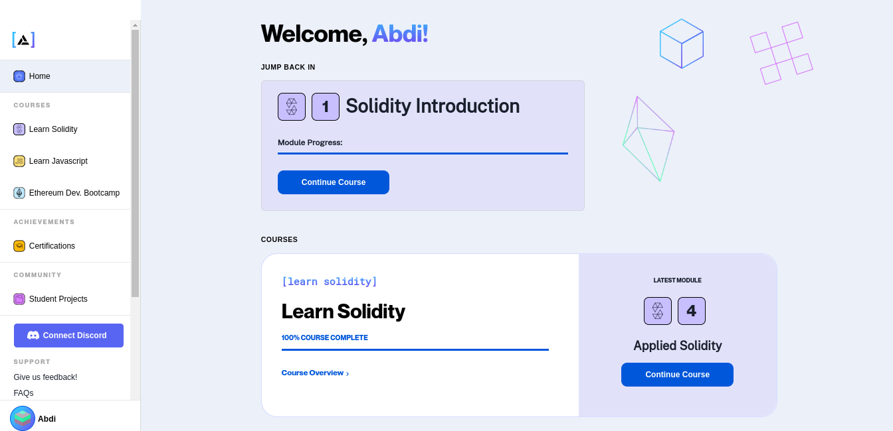
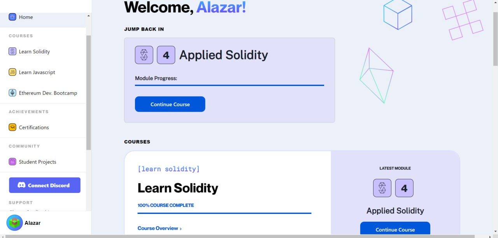
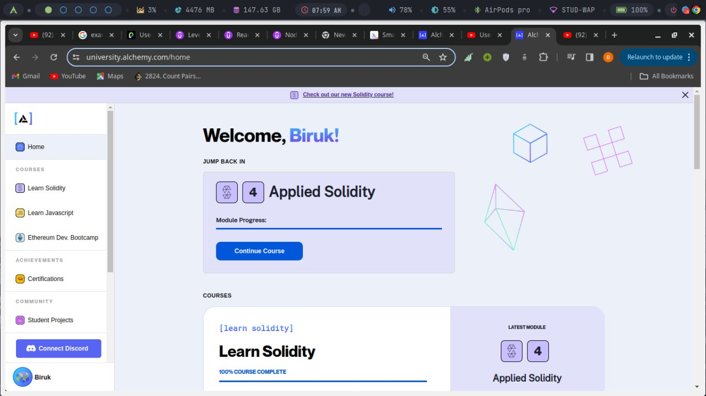
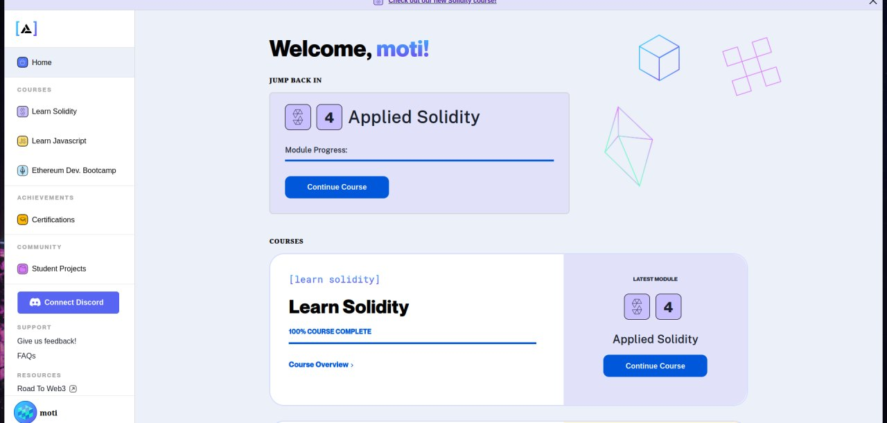
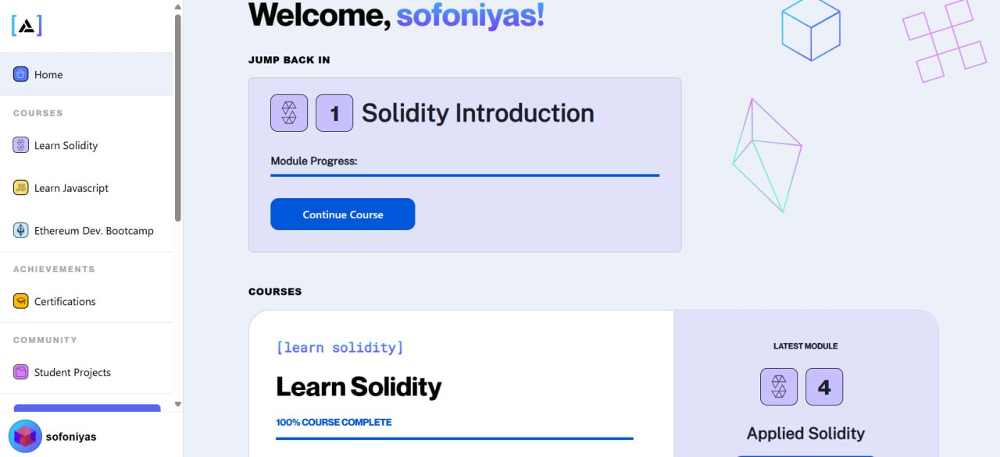
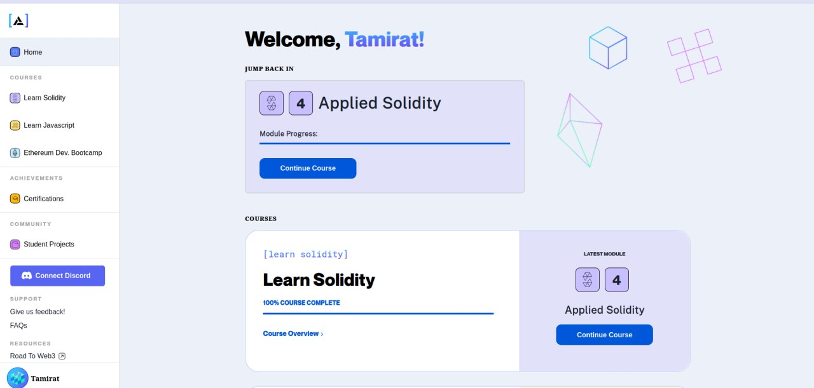

# 🚀 Learn Solidity with Alchemy 🎓

Welcome to our project repository for the **Learn Solidity** course from Alchemy!

### Introduction

This repository documents our progress and experiences as we learned Solidity, the primary language for writing smart contracts on Ethereum. Through this course, we explored the intricacies of blockchain technology and gained hands-on experience in developing our own smart contracts.

### Course Details

We took the **Learn Solidity** course on [Alchemy](https://www.alchemy.com/). This course provided a comprehensive introduction to Solidity, guiding us from the basics to more advanced concepts. We learned about everything from basic syntax to deploying our own tokens.

### Our Journey

#### Getting Started

We started off by setting up our development environments and writing our first simple smart contracts. It was exciting to see our code deployed on the blockchain, even if it was just a basic storage contract!

#### Diving Deeper

As we progressed, we tackled more complex topics like inheritance, libraries, and interfacing with existing smart contracts. We also got our hands dirty with practical exercises that helped reinforce our learning.

### Screenshots

#### 🎉 100% Course Completion

---
---

---
---

---
---

---
---

---
---

---
---

## Team

This project was a collaborative effort by our team members:

- **Abdi Dereje - ugr/22538/13**
- **Alazar Meshesha - ugr/22728/13**
- **Biruk Akililu - ugr/23404/13**
- **Moti Rebuma - ugr/22935/13**
- **Sofoniyas Fasil - ugr/22600/13**
- **Tamirat Ayalew - ugr/23496/13**

